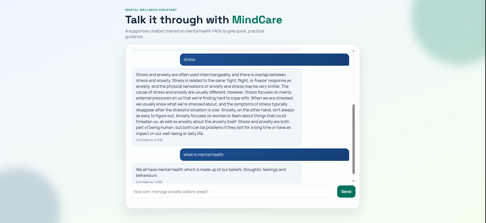

# MindCare Mental Health Chatbot

A Flask-based mental wellness chatbot that answers mental-health-related questions using semantic similarity over an FAQ dataset.

The project combines:
- A Python backend (Flask + scikit-learn)
- A lightweight NLP pipeline (text cleaning + TF-IDF + cosine similarity)
- A responsive web chat interface (HTML, CSS, JavaScript)

## Overview

MindCare uses a retrieval-based approach:
1. User submits a question.
2. The question is normalized with a text cleaning function.
3. The question is vectorized with TF-IDF.
4. Cosine similarity is computed against preprocessed FAQ questions.
5. The best match is returned with a confidence score.
6. If confidence is below threshold, a fallback response is shown.

This makes the chatbot deterministic, fast, and easy to maintain for FAQ-style support scenarios.

## Features

- Clean chat UI with responsive design
- Real-time chat requests using fetch (no page reload)
- Confidence scoring for each answer
- Session-based conversation history (recent messages)
- Fallback response for low-confidence queries
- Simple architecture suitable for student projects and rapid prototyping

## Screenshot



## Tech Stack

- Python 3.9+
- Flask
- pandas
- scikit-learn
- NumPy
- HTML/CSS/JavaScript

## Project Structure

- app.py: Flask app, routing, and FAQ retrieval logic
- clean_text.py: input normalization and preprocessing
- Mental_Health_FAQ.csv: knowledge base for Q/A retrieval
- templates/index.html: main UI template
- static/css/style.css: styling and responsive layout
- static/js/chat.js: client-side chat logic
- explore.ipynb: experimentation notebook

## How It Works

### Data Preparation

On startup, the app loads the CSV file and builds:
- cleaned question corpus
- original answer corpus
- TF-IDF matrix for all questions

### Retrieval Logic

For each user query:
- preprocess query with clean_text
- transform to TF-IDF vector
- calculate cosine similarity with the question matrix
- choose the highest-similarity item
- return matched answer + confidence score

### Fallback Strategy

If confidence is below 0.15, the app returns a supportive fallback message encouraging the user to rephrase.

## Local Setup

### 1) Clone the repository

Use your preferred Git workflow to clone this project.

### 2) Create and activate a virtual environment

Linux or macOS:

```bash
python3 -m venv .venv
source .venv/bin/activate
```

Windows (PowerShell):

```powershell
python -m venv .venv
.venv\Scripts\Activate.ps1
```

### 3) Install dependencies

```bash
pip install -r requirements.txt
```

### 4) Run the app

```bash
python app.py
```

The server starts in debug mode and is typically available at:

http://127.0.0.1:5000

## API

### POST /ask

Request body:

```json
{
  "question": "How can I reduce stress quickly?"
}
```

Success response:

```json
{
  "question": "How can I reduce stress quickly?",
  "answer": "...",
  "confidence": 0.742
}
```

Validation error response:

```json
{
  "error": "Please enter a question."
}
```

## Security and Configuration

Set a secure secret key in production:

```bash
export FLASK_SECRET_KEY="replace_with_a_long_random_secret"
```

Recommended production considerations:
- turn off debug mode
- run behind a WSGI server (for example, gunicorn)
- use HTTPS at the reverse proxy level
- add request rate limiting

## Responsible Use and Safety Notice

This project is an educational/support chatbot and not a substitute for professional medical or psychiatric care.

If a user may be in immediate danger or crisis, they should contact local emergency services or a qualified mental health professional immediately.

## Known Limitations

- Retrieval-only model (no generative reasoning)
- Performance depends on FAQ data quality and coverage
- English-centric preprocessing
- No built-in user authentication
- No persistent database (session-based history only)

## Suggested Improvements

- Add intent routing for common topics (anxiety, sleep, stress)
- Add multilingual preprocessing and FAQ corpora
- Add crisis keyword detection and escalation guidance
- Add test suite for text preprocessing and API endpoints
- Containerize with Docker and add CI workflow
- Deploy with gunicorn + nginx

## Troubleshooting

- If port 5000 is busy, run with a different port via Flask configuration.
- If answers seem noisy, verify CSV quality and retrain vectorization at startup.
- If static styles are missing, verify templates and static folder paths.

## License

MIT License

## CodeAlpha AI Internship Context

CodeAlpha provides practical internship experience in AI through real project tasks, mentorship, and industry-oriented workflows.

## Author

[ISSAM SENSI](https://issamsensi.com)
